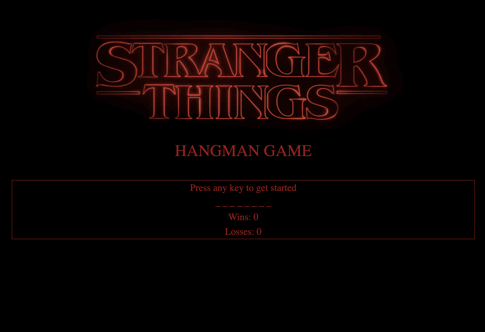

# Word Guess Game

## Description

This is a simple word guessing game written in pure JavaScript with no libraries or jQuery. The layout is designed using some basic Bootstrap. The theme is based around the popular Netflix series "Stranger Things." To play click any letter to begin. If you guess incorrectly 11 times you lose, guess the word before then and you win. The each round alerts you if you win and plays a sound or lose and resets to the next word. 

